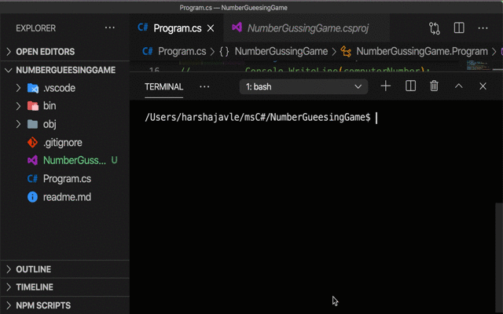

# The Number Guessing Game 

## Game Description 
#### The Guessing Game is an interactive game created with `C#` programming language 
---
## User Story
    As a user I want to play a guessing game created by python
    so that I can play a guessing game for fun. 

## Acceptance Criteria 
**_Given_** that the user guesses a number starts the guessing game with a random number
    
**_When_** the user guesses a number the computer will give various hints if the number is too high or too low
    
***_Then_*** when user guesses the correct number the computer will print the answer along with the number of attempts by the user. 

    
    Validate the user has five attempts to guess the correct number
    Validate the computer will generate a random number 

---
## Homework Instructions
* Create `Program.cs` file
* Create a `GitHub` repo for your game
* Commit to `GitHub` at least five times
* Use `C#` module `random`
* Prompt user to enter their name
* Create variable named `numberOfGuesses` and assign `0` to the variable 
* Print a `string` that includes the players name
* Create a `while loop`

---
## Remember TechBridge TECH Goals

**_T_** : Time management skills will provide a positive guide for you.

**_E_** : Effort is an important part of the success of the course.
    
**_C_** : Communication regularly with the instructor and other students is imperative.
    
**_H_** :  Homework, assignments and quizzes should be submitted by deadlines.

---
### Bonus
* Add a gif

## ❤ **_Happy Coding_** ❤

